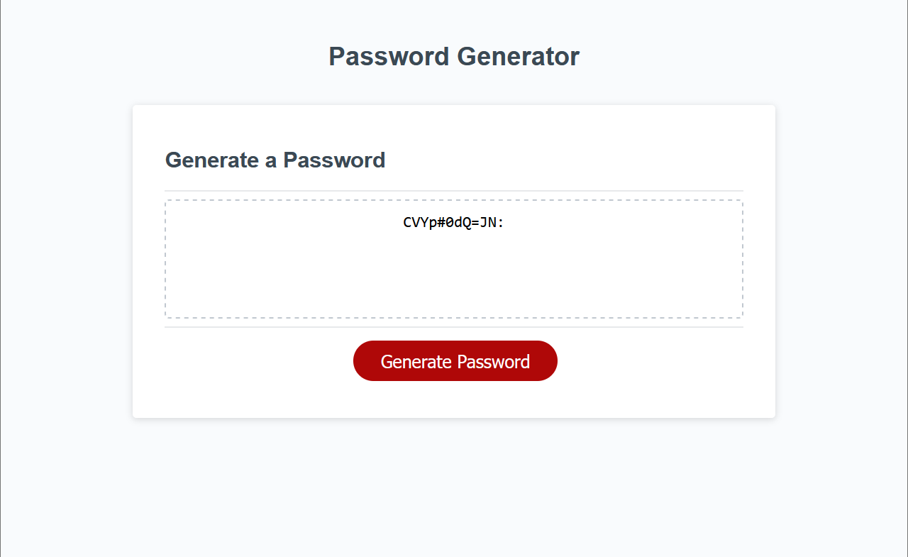

# Random Password Generator

## Description
This website is a random, strong password generator for when you need a strong password for an account.
Multiple people have tons of accounts, and a large portion of those people have the same password for multiple accounts. This makes these individuals an easy target for potentially getting their account hacked, especially if they have a generic password that can easily be guessed. So how can these people prevent this from happening? This website is the answer. Random, strong passwords are a great way to prevent yourself from getting your account hacked.

## Usage
This website was created using HTML, CSS, and JavaScript. How it works is that once the user clicks the 
"Generate Password" button, a random password using a combination of letters (uppercase and lowercase), numbers, and symbols in random order with a 12 character length. To make this work, you first have to determine what makes a strong password, *strong*. This includes letters both uppercase and lowercase, numbers ranging from 0-9, and the following symbols: `!#$%&'()*+,-./:;<=>?@[\]^_`{|}~`. Then to create a random password using those characters, I found the most efficient way to do it was to combine all characters into one variable then iterating through variable creating a random sequence of characters using Math.random. Which then displays to user what password was generated so they can copy and use it as they please.

## Images 

## Link
If you would like to visit the website and try it out yourself, [visit this link here].